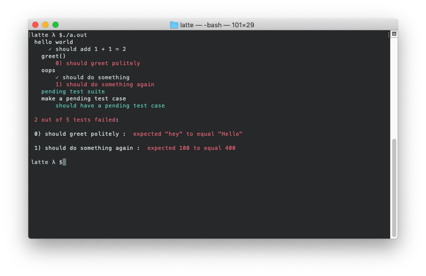

# latte

A C++ testing framework that's as easy as sipping a latte.





## Usage

To use this library, install [buckaroo](https://github.com/LoopPerfect/buckaroo/wiki/Installation#buckaroo) and [buck](https://github.com/LoopPerfect/buckaroo/wiki/Installation#buck). Once installed, [initialize](https://github.com/LoopPerfect/buckaroo/wiki/Commands#init) buckaroo in your project folder and run the following command:

```bash
# Add the latest version
buckaroo add github.com/iwatakeshi/latte/
# Install dependencies
buckaroo install
```
To run the tests, simply run:

```bash
buck test :test
```

> `buck` only supports Google's and Boost's test library causing the test to fail at the end, but this should be ignored.

## About

latte is a testing framework that's heavily inspired by [mocha](http://mochajs.org/) and [chai](http://chaijs.com/). It started from an effort to become the spiritual successor of [macchiato](https://github.com/MadLittleMods/macchiato).

## Contribute

latte isn't complete without your help. Submit a pull request or start a discussion. I'd be glad to add some sweetness to latte.

## API

### latte

| Function | Description  |
|----------------|--------------|
| `describe(string description)` |  Describes a pending test suite.    |
| `describe(string description, function<void> callback)`       | Describes the test suite and can be nested. |
| `describe.only(string description)` |  Describes a pending test suite that is strictly performed.    |
| `describe.only(string description, function<void> callback)`       | Describes the test suite that is strictly performed and can be nested. |
| `it(string description)` |  Describes a pending test case.    |
| `it(string description, function<(void)> callback)` 		| Describes the test case. |
| `it.only(string description)` |  Describes a pending test case that is stricly performed.    |
| `it.only(string description, function<(void)> callback)` 		| Describes the test case that is strictly performed. |

### expect

| Function | Description |
|--------------|-------------|
| `expect(T actual)` | Returns a pointer of type `expect_t` that provides a [chainable](#BDD) API.

#### Example

```cpp
#include <iostream>
#include <latte.hpp>
using namespace latte;
using latte::style::expect;

latte::runner([&] () {
  describe("Car", [&]() {
    // Test values with the same type.
    it("should have 4 wheels", [&]() {
      expect(Car().getNumWheels())).to->equal(4);
    });

    // Test values with different types
    it("should determine if engine has started", [&] () {
      expect(Car().hasEngineStarted()).to->strict_equal("true");
    });

    // Test values with same or different types using a comparator function (lambda).
    it("should have foor doors 4 doors. (comparator function)", [&] () {
      auto comparator = [&] (Car a, int b) {
        return a.getNumDoors() == b;
      });
      expect(Car()).to->equal(4, comparator);
    });
  });
});
```


## BDD

Behaviour driven development (BDD)

 - `expect`
    - `expect(actual).then->then->then->equal(expected);`

## Language Chains

Provided as chainable getters to improve the readability of your assertions. They do not provide testing capabilities.

 - `to`
 - `be`
 - `been`
 - `is`
 - `that`
 - `which`
 - `then`:
    - *substitute for `and` because `and` is a reserved keyword in C++*
 - `has`
 - `have`
 - `with`
 - `at`
 - `of`
 - `same`

## Chainable Test API

These provide actual functionality in the chain.

| Member   | Alias(s)  | Description | Example  |
|--------|--------|-------------|----------|
| `never`|        | Negates any of assertions following in the chain. *substitute for `not` because `not` is a reserved keyword in C++* | `expect(3).to->never->equal->(3);` |
| `equal(U value)`| `eql(...)` | Asserts that the target loosely equals (==) to `value`. | |
| `equal(U value, latte_comparator comparator)`| `eql(...)` | Asserts that the target loosely equals (==) to `value`. | |ue`. | |
| `strict_equal(U value, latte_comparator comparator)`| `seql(...)` | Asserts that the target strictly equals (==) to `value`. | |
| `close_to(double expected, double tolerance)` | | Asserts that the target is equal to `expected`, to within a +/- `tolerance` range. | |
| `within(double lower, double upper)`         | | Asserts that the target is within a range. | |
| `above(double value)` | `gt(...)`, `greater_than(...)`| Asserts that the target is greater than `value`. | |
| `least(double value)` |`gte(...)` |Asserts that the target is greater than or equal to `value`. | |
| `below(double value)` | `lt(...)`, `lessThan(...)` | Asserts that the target is less than `value`. | |
| `most(double value)`| `lte(...)` | Asserts that the target is less than or equal to `value`. | |
| `satisfy(function<bool, T> test, function<string, T, expect_flags> fail?)` | | Asserts that the target passes a given truth test. | |
| `satisfy(bool test_result_bool, string fail_message)` | | Asserts that the target passes a given truth test. | |
